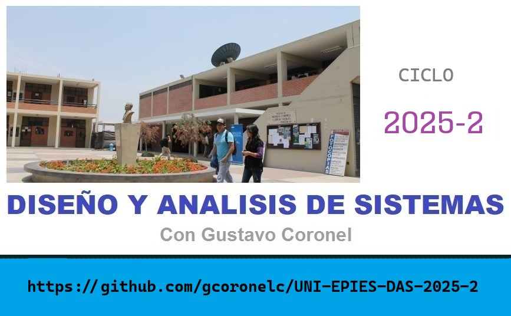

# UNI-EPIES

- Lugar: UNI - FIEECS
- Horario 1: JUE de 3 a 5 pm (Practica)
- Horario 2: VIE de 3 a 6 pm (Teoria)
- Inicio: 26.MAR.2026
- Delegado: 
- Subdelegada: 

# DOCENTE

- Docente: Dr. Eric Gustavo Coronel Castillo
- Email: gcoronel@uni.edu.pe
- Blog: https://gcoronelc.blogspot.com/
- Canal Youtube: https://www.youtube.com/DesarrollaSoftware
- Cursos Virtuales: http://gcoronelc.github.io/

# ENLACES

## Repositorios

- Bases de datos: https://github.com/gcoronelc/databases
- Recursos: https://github.com/gcoronelc/recursos

## Cursos Virtuales

- Java Fundamentos: https://www.youtube.com/watch?v=MzFfkeuRAd8&list=PLIRq7nByT7aT_1wuNdJXhIFMLpJO1PKUc
- Java Orientado a Objetos: https://www.youtube.com/watch?v=EKlwF12-l9Y&list=PLIRq7nByT7aRuBgD4UVRjrcUZFM8Fkbut
- Java CLIENTE-SERVIDOR: https://www.youtube.com/watch?v=MR53Xgeg28Y&list=PLIRq7nByT7aQlHn2S4gBdEQZXfgYMMKC2
- Java Web: https://www.youtube.com/watch?v=HmXzOms6rvA&list=PLIRq7nByT7aTdpBXMuBjb-TL2kvrUpazI

## RUP

- Enlace 1: https://youtu.be/AY5Dh3XYshk
- Enlace 2: https://youtu.be/tbnU0jZzKTE
- Enlace 3: https://youtu.be/PAY1fpdtzrk

## Arquitectura de Software

- https://www.youtube.com/watch?v=2Bcbls0bBzs

## Casos de Uso

- https://youtu.be/orvAkFFWo5o
- http://www.juntadeandalucia.es/servicios/madeja/contenido/recurso/416

## Pruebas de Software

- https://youtu.be/6EqQWVQNwlw

## Diagramas de Secuencia

- https://youtu.be/Q1kH7XKxK5I
- https://youtu.be/xiQfSFxuuBw

## Biblioteca Cientifica

- https://sci-hub.se/